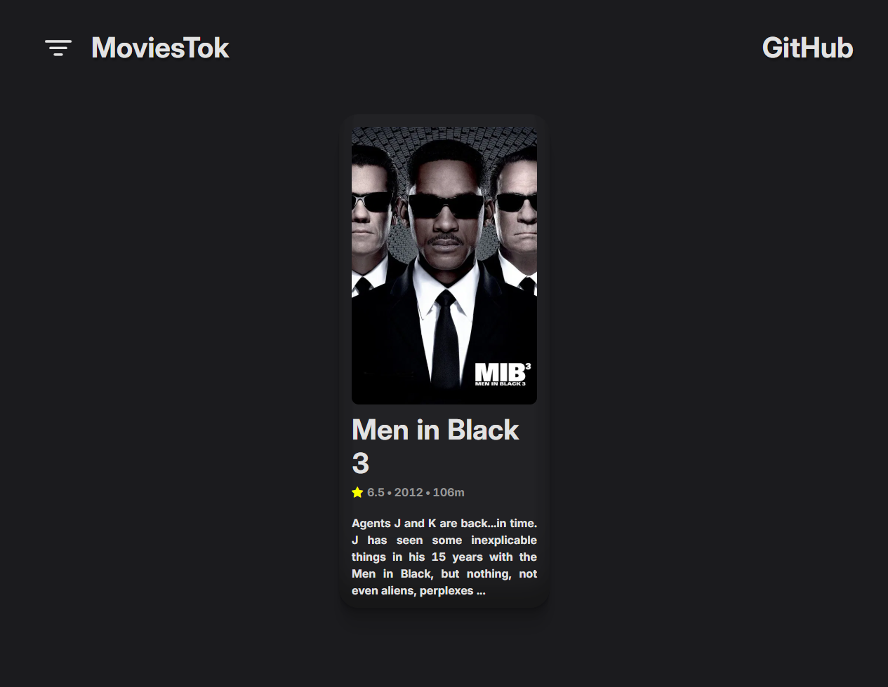

# What is it?

 

Many people have the problem of not knowing what to watch in the evening. So I created a website where you can randomly
search for movies, just like a feed on TikTok. You can also use filters to make searching for movies more enjoyable!

# Quick Start

The site can be accessed at https://movies-tok.netlify.app

# Source Code

First, let's clone the repository:

```
git clone https://github.com/sh4man4ik/MoviesTok.git
```

Next, go to our directory:

```
cd MoviesTok
```

Next, download the dependencies:

```
npm install
```

Launching the website:

```
npm run dev
```

# Technology

I used the following technologies to create the website: _React_, _Vite_, _Node.js_, _Bootstrap_, _Google Fonts_.
